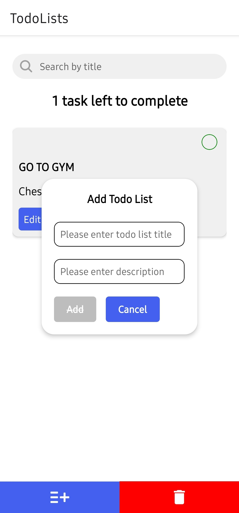
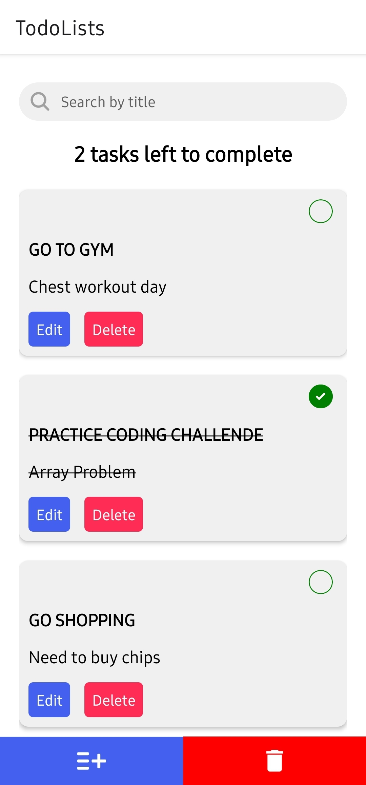
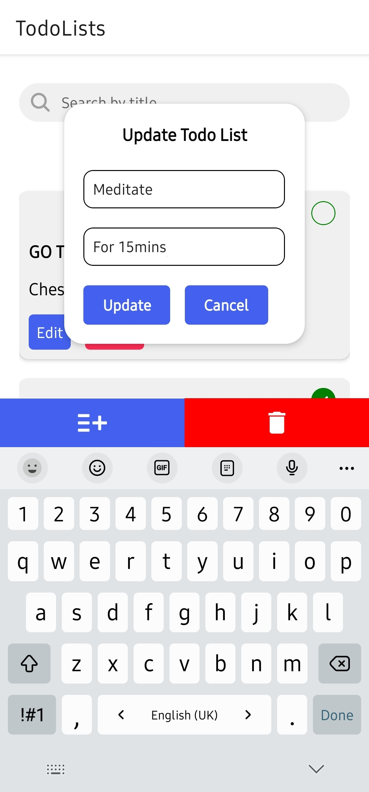

<a name="readme-top"></a>

<div align="center">

  <h1><b>Todo List</b></h1>

</div>

<div align="center" style="display: flex; justify-content: space-around;">
  
  
  
</div>
<!-- TABLE OF CONTENTS -->

# 📗 Table of Contents

- [📖 About the Project](#about-project)
  - [🛠 Built With](#built-with)
    - [Tech Stack](#tech-stack)
    - [Key Features](#key-features)
  - [🚀 Live Demo](#live-demo)
- [💻 Getting Started](#getting-started)
  - [Prerequisites](#prerequisites)
  - [Setup](#setup)
  - [Install](#install)
  - [Usage](#usage)
- [👥 Authors](#authors)
- [🤝 Contributing](#contributing)
- [⭐️ Show your support](#support)
- [🙏 Acknowledgements](#acknowledgements)
- [📝 License](#license)

<!-- PROJECT DESCRIPTION -->

# 📖 Todo List <a name="about-project"></a>

**Todo List** is a code test given to me by [Quibit](https://www.facebook.com/quibit21092023). It's a simple todo list application that allows users to add, delete and update their tasks along with the search feature.

## 🛠 Built With <a name="built-with"></a>

### Tech Stack <a name="tech-stack"></a>

<label>Client</label>

  <ul>
    <li><a href="https://www.typescriptlang.org/">TypeScript</a></li>
    <li><a href="https://reactnative.dev/">React Native</a></li>
    <li><a href="https://reactnavigation.org/">React Navigation</a></li>
    <li><a href="https://redux-toolkit.js.org/">Redux Toolkit</a></li>
  </ul>

<!-- Features -->

### Key Features <a name="key-features"></a>

- **CRUD Operations for Todo Lists**
- **Search Feature by Their Title**

<p align="right">(<a href="#readme-top">back to top</a>)</p>


<!-- GETTING STARTED -->

## 💻 Getting Started <a name="getting-started"></a>

To get a local copy up and running, follow these steps.

### Prerequisites

In order to run this project you need:

- [Expo](https://play.google.com/store/apps/details?id=host.exp.exponent&hl=en&gl=US) App
- Android Phone
- npm
- Node.js

### Setup

Clone this repository to your desired folder:

```sh
  cd my-folder
  git clone https://github.com/K0ppai/Quibit-Test.git
```

### Install

Install the prerequisites this project using:

```sh
  cd Quibit-Test

  npm install
```

### Usage

To run the project, execute the following command:


```
  npm run start
```
Secondly, open [Expo](https://play.google.com/store/apps/details?id=host.exp.exponent&hl=en&gl=US) app on android and scan the QR code to run the app.

<p align="right">(<a href="#readme-top">back to top</a>)</p>

<!-- AUTHORS -->

## 👥 Authors <a name="authors"></a>

👤 **Paing Soe Thu**

- GitHub: [@K0ppai](https://github.com/K0ppai)
- Twitter: [@_koppai_](https://twitter.com/_koppai_)
- LinkedIn: [LinkedIn](https://www.linkedin.com/in/paingsoe-thu)

<p align="right">(<a href="#readme-top">back to top</a>)</p>

<!-- CONTRIBUTING -->

## 🤝 Contributing <a name="contributing"></a>

Contributions, issues, and feature requests are welcome!

Feel free to check the [issues page](https://github.com/K0ppai/Quibit-Test/issues).

<p align="right">(<a href="#readme-top">back to top</a>)</p>

<!-- SUPPORT -->

## ⭐️ Show your support <a name="support"></a>

If you like this project, don't forget to give it a ⭐️!

<p align="right">(<a href="#readme-top">back to top</a>)</p>

<!-- ACKNOWLEDGEMENTS -->

## 🙏 Acknowledgments <a name="acknowledgements"></a>

I would like to thank [Quibit](https://www.facebook.com/quibit21092023) for giving me this amazing opportunity to work on this project.

<p align="right">(<a href="#readme-top">back to top</a>)</p>

<!-- LICENSE -->

## 📝 License <a name="license"></a>

This project is [MIT](https://github.com/K0ppai/Quibit-Test/blob/develop/MIT.md) licensed.

<p align="right">(<a href="#readme-top">back to top</a>)</p>
